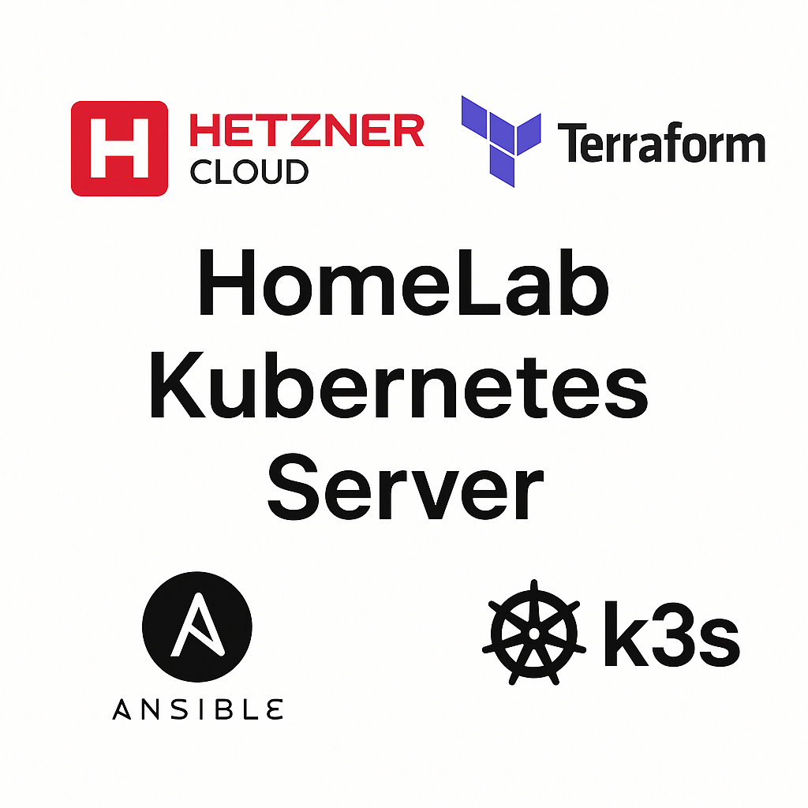

# Hetzner Cloud K3s Cluster with Terraform + Ansible

Automated deployment of a K3s Kubernetes cluster on Hetzner Cloud, using Infrastructure as Code principles with Terraform and Ansible.



## 📋 Contents

1. [Overview and Architecture](#overview-and-architecture)
2. [Prerequisites](#prerequisites)
3. [Step 1: SSH Key Setup](#step-1-ssh-key-setup)
4. [Step 2: Configuration](#step-2-configuration)
5. [Step 3: Infrastructure Deployment](#step-3-infrastructure-deployment)
6. [Step 4: Cluster Access](#step-4-cluster-access)
7. [Step 5: Testing the Cluster](#step-5-testing-the-cluster)
8. [Step 6: LoadBalancer Demo Application](#step-6-loadbalancer-demo-application)
9. [Step 7: Cleanup (Optional)](#step-7-cleanup-optional)
10. [Advanced Topics](#advanced-topics)
11. [Troubleshooting](#troubleshooting)

## Overview and Architecture

### What This Project Does
- **Creates servers** on Hetzner Cloud using Terraform
- **Configures a K3s cluster** using Ansible
- **Organizes resources** with networks and tags
- **Provides testing tools** for validation

### Architecture Components
- **1 Master node** (k3s server) - manages the Kubernetes control plane
- **2 Worker nodes** (k3s agents) - run workloads and pods
- **Private network** for communication (10.0.1.0/24)
- **Automated SSH key management** for secure access
- **Load Balancer** for service access

### Important Notes
- ✅ **Tested on**: AlmaLinux 9 servers
- 🔑 **Requirements**: Hetzner Cloud API token and SSH keys

## Prerequisites

Before you begin, make sure you have:

### On Your Local Machine
- **Terraform** >= 1.0
- **Ansible** >= 2.9
- **kubectl** (for cluster management)
- **git** (for repository cloning)
- **hcloud CLI** (optional, for managing Hetzner Cloud resources)

### In Hetzner Cloud
- **Hetzner Cloud account** with API access
- **API token** with full permissions
- **SSH key** added to your Hetzner Cloud account

## Step 1: SSH Key Setup

Before deploying the cluster, you need to generate SSH keys for secure access.

### 1.1 Generating Keys for Terraform/Ansible Access

These keys will be used by Terraform and Ansible for accessing and configuring the servers:

```bash
# Generate SSH key pair for external access
ssh-keygen -t ed25519 -C "terraform@hetzner.dev" -f ~/.ssh/id_ed25519

# Set proper permissions
chmod 600 ~/.ssh/id_ed25519
```

**When prompted, press enter to leave the passphrase empty.**

### 1.2 Generating Keys for K3s Cluster Node Communication

These keys enable secure communication between cluster nodes:

```bash
# Create directory for ansible keys
mkdir -p ansible/keys/

# Generate RSA key pair for cluster communication
ssh-keygen -t rsa -b 2048 -C "k3s-cluster@hetzner" -f ansible/keys/k3s_cluster_key

# Set proper permissions
chmod 600 ansible/keys/k3s_cluster_key
chmod 644 ansible/keys/k3s_cluster_key.pub
```

**When prompted, press enter to leave the passphrase empty.**

### Key Summary
- **`~/.ssh/id_ed25519`**: External access from your machine to the servers
- **`ansible/keys/k3s_cluster_key`**: Communication between nodes in the cluster
- **Security**: Keys are excluded from git via `.gitignore`

## Step 2: Configuration

Now configure the project for your environment.

### 2.1 Navigate to the Terraform Directory

```bash
cd terrafrom/
```

### 2.2 Configure terraform.tfvars

Edit `terraform.tfvars` with the details for your environment:

```hcl
# Hetzner Cloud API access
hcloud_token = "your-hetzner-cloud-api-token"

# Infrastructure
node                     = "node"
worker_count             = 2
image                    = "alma-9"
server_type              = "cx22"
datacenter               = "fsn1-dc14"

# Network configuration
network_zone = "eu-central"
network_name = "kube-network"
ip_range     = "10.0.0.0/16"
subnet_ip_cidr = "10.0.1.0/24"

# SSH access
ssh_key_fingerprint = "51:b1:4d:17:30:a9:d3:c4:57:1f:bf:c9:63:8a:96:3a"
ssh_allowed_ip      = "your-public-ip"

# Load Balancer 
load_balancer_type = "lb11" 
```

### Configuration Parameters Explanation

| Parameter | Description | Example |
|-----------|-------------|--------|
| `hcloud_token` | Hetzner Cloud API token | `your-hetzner-cloud-api-token` |
| `node` | Base name for nodes | `node` |
| `worker_count` | Number of worker nodes | `2` |
| `image` | Server image | `alma-9` |
| `server_type` | Server type | `cx22` |
| `datacenter` | Data center | `fsn1-dc14` |
| `network_zone` | Network zone | `eu-central` |
| `ssh_key_fingerprint` | Your SSH key fingerprint | Copy from Hetzner Cloud console |

**Important**: Add your Hetzner Cloud API token in the `hcloud_token` field or use the hcloud CLI configuration.

## Step 3: Infrastructure Deployment

Now deploy the K3s cluster infrastructure.

### 3.1 Automated Deployment (Recommended)

Return to the project's root directory and run the deployment script:

```bash
# Return to the project root directory
cd ..

# Run the automated deployment script
./deploy.sh
```

**What the script does:**
- ✅ Checks all prerequisites (SSH keys, configuration files, tools)
- ✅ Shows a deployment summary with your configuration
- ✅ Executes terraform init, validate, plan, and apply automatically
- ✅ Triggers Ansible playbooks to configure K3s
- ✅ Provides post-deployment instructions
- ✅ Handles errors gracefully with colored output

### 3.2 Manual Deployment (Alternative)

If you prefer manual control:

```bash
cd terrafrom/
terraform init
terraform validate
terraform plan
terraform apply
```

**Confirm terraform apply by typing "yes" and wait for deployment to complete.**

### 3.3 What Happens During Deployment

1. **Terraform Phase** (5-10 minutes):
   - Creates servers in Hetzner Cloud
   - Configures networks and storage
   - Sets up SSH access

2. **Ansible Phase** (5-10 minutes):
   - Installs K3s on the master node
   - Configures worker nodes
   - Sets up cluster networking
   - Distributes SSH keys

**Total deployment time: ~10-20 minutes**

## Infrastructure Destruction

When you need to completely remove the K3s cluster and all related resources:

### Option 1: Using the Automated Destruction Script (Recommended)

```bash
# Run the automated destruction script from the project root directory
./destroy.sh
```

The script will:
- Check prerequisites and show what will be destroyed
- Automatically backup your kubeconfig file
- Create a destruction plan and request confirmation
- Require typing 'DESTROY' in capital letters for final confirmation
- Safely remove all servers, networks, and configurations
- Provide post-destruction cleanup recommendations

### Option 2: Manual Destruction

```bash
cd terrafrom/
terraform plan -destroy
terraform destroy
```

?????? **Warning**: Destroying the infrastructure will permanently delete:
- All servers and their data
- All Kubernetes workloads and persistent volumes
- All cluster configurations
- Hetzner Cloud networks and load balancer

This action cannot be undone!

## Ansible Integration

Ansible is automatically triggered by Terraform through `null_resource` provisioners. The process:

1. **Terraform creates servers** with configuration
2. **Waits for SSH availability** on each node
3. **Executes master playbook** (`../ansible/install-master.yml`)
4. **Executes worker playbooks** (`../ansible/install-workers.yml`) 
5. **Worker nodes join the cluster** using tokens from master

Ansible playbooks take care of:
- Installing packages (k3s, dependencies)
- Distributing SSH keys for inter-node communication
- Initializing K3s master
- Joining worker nodes with the correct tokens
- Shell configuration (zsh with antigen)

### Environment Variables

The deployment script (`deploy.sh`) exports environment variables that are used by the Ansible playbooks:

```bash
# K3s version to install
export K3S_VERSION="v1.27.5+k3s1"

# Hetzner Cloud API token for cloud controller manager
export HCLOUD_TOKEN="your-hetzner-cloud-api-token"
```

These variables are used by the Ansible playbooks to:
- Install the correct version of K3s
- Configure the Hetzner Cloud Controller Manager for LoadBalancer support
- Enable proper integration with Hetzner Cloud resources

## Step 4: Cluster Access

After successful deployment, access your K3s cluster.

### 4.1 Getting Cluster Information

```bash
# Navigate to terraform directory
cd terrafrom/

# View all deployment outputs
terraform output
```

### 4.2 Copying Kubeconfig

```bash
# Get the command for copying kubeconfig
terraform output kubeconfig_command

# Execute the displayed scp command (example):
# scp -i ~/.ssh/id_ed25519 root@<master-ip>:~/.kube/config ./kubeconfig
```

### 4.3 Testing Cluster Connectivity

```bash
# Test cluster access
kubectl --kubeconfig ./kubeconfig get nodes
```

**Expected output:**
```bash
NAME         STATUS   ROLES                  AGE   VERSION
kube-master   Ready    control-plane,master   5m    v1.27.5+k3s1
kube-worker-1 Ready    <none>                 4m    v1.27.5+k3s1
kube-worker-2 Ready    <none>                 4m    v1.27.5+k3s1
```

### 4.4 SSH Access to Nodes

```bash
# SSH to master node
ssh -i ~/.ssh/id_ed25519 root@<master-ip>

# SSH to worker nodes
ssh -i ~/.ssh/id_ed25519 root@<worker-1-ip>
ssh -i ~/.ssh/id_ed25519 root@<worker-2-ip>
```

## Step 5: Testing the Cluster

Validate the functionality of your K3s cluster with a comprehensive test application.

### 5.1 Deploying the Test Application

```bash
# Navigate to demo-deploy directory
cd ../demo-deploy/

# Deploy test application
./deploy-test-app.sh
```

**What the test application provides:**
- ✅ **3 nginx replicas** with customized content
- ✅ **NodePort service** for direct IP access
- ✅ **Load balancing** between worker nodes
- ✅ **Automated tests** for connectivity verification
- ✅ **Real-time monitoring** of cluster status

### 5.2 Accessing the Test Application

**Direct IP access (Recommended):**
```bash
# Access via NodePort on master IP
http://<master-ip>:30080
```

**Port Forward (Alternative):**
```bash
kubectl port-forward -n k3s-test svc/k3s-test-app 8080:80
# Visit: http://localhost:8080
```

### 5.3 What the Test Validates

The test application confirms:
- ✅ **Container Runtime** - containerd pulling and executing images
- ✅ **Service Discovery** - Internal DNS and service mesh
- ✅ **Load Balancing** - Traffic distribution between pods
- ✅ **Networking** - Pod-to-pod and external communication
- ✅ **ConfigMaps** - Configuration injection and mounting
- ✅ **Health Checks** - Liveness and readiness probes

### 5.4 Test Monitoring

```bash
# Check pods across nodes
kubectl get pods -n k3s-test -o wide

# View service details
kubectl get svc -n k3s-test

# Watch logs
kubectl logs -n k3s-test -l app.kubernetes.io/name=k3s-test-app -f
```

## Step 6: LoadBalancer Demo Application

Test the Hetzner Cloud LoadBalancer integration with a demo application.

### 6.1 Deploying the LoadBalancer Demo

```bash
# Navigate to demo-deploy directory
cd helm/

# Deploy LoadBalancer demo application
./deploy-lb-app.sh
```

**What the LoadBalancer demo provides:**
- ✅ **NGINX web server** with custom HTML interface
- ✅ **Python sidecar container** providing server information
- ✅ **Hetzner Cloud LoadBalancer** with external IP
- ✅ **Real-time server information** (hostname, pod IP, node name, LoadBalancer IP)
- ✅ **Automatic IP detection** from Hetzner Cloud API

### 6.2 Accessing the LoadBalancer Demo

The script will output the LoadBalancer IP address. You can access the application at:

```
http://<loadbalancer-ip>
```

The application displays:
- Pod hostname
- Pod IP address
- Kubernetes node name
- LoadBalancer external IP

### 6.3 How It Works

The LoadBalancer demo showcases:
- Hetzner Cloud LoadBalancer integration with Kubernetes
- Multi-container pods with nginx and Python sidecar
- ConfigMap for configuration and HTML content
- Environment variable passing between containers
- Dynamic information retrieval via HTTP endpoints

### 6.4 Cleaning Up the LoadBalancer Demo

```bash
# From the demo-deploy directory
./destroy-lb-app.sh
```

## Step 7: Cleanup (Optional)

When you have finished testing or want to remove resources.

### 7.1 Cleaning Up the Test Application

**Automated cleanup (Recommended):**
```bash
# From the demo-deploy directory
./destroy-test-app.sh
```

**Manual cleanup:**
```bash
helm uninstall k3s-test-app -n k3s-test
kubectl delete namespace k3s-testgit 
```

### 7.2 Destroying the Infrastructure

**Automated destruction (Recommended):**
```bash
# Return to the project root directory
cd ..

# Run the destruction script
./destroy.sh
```

**Manual destruction:**
```bash
cd terrafrom/
terraform plan -destroy
terraform destroy
```

?????? **Warning**: This will permanently delete all servers, data, and configurations!

---

## Advanced Topics

### SSH Access

Connecting to cluster nodes using the generated SSH keys:

```bash
# Master node
ssh -i ~/.ssh/id_ed25519 root@<master-ip>

# Worker nodes  
ssh -i ~/.ssh/id_ed25519 root@<worker-1-ip>
ssh -i ~/.ssh/id_ed25519 root@<worker-2-ip>
```

## Testing the Cluster with Nginx

Test your cluster by deploying a simple Nginx service:

```bash
# Create nginx deployment
kubectl --kubeconfig ./kubeconfig create deployment nginx --image=nginx

# Expose as NodePort service
kubectl --kubeconfig ./kubeconfig expose deployment nginx --port=80 --type=NodePort

# Get service details
kubectl --kubeconfig ./kubeconfig get services
```

Access the service using the IP address of any node and the assigned NodePort.

## Security Features

- **SSH key-based authentication** - no password access
- **Inter-node communication** through dedicated SSH keys
- **Private network isolation** - cluster on a dedicated subnet
- **Protection of sensitive variables** - marked as sensitive in Terraform

### Security Best Practices

- Store sensitive values in environment variables:
```bash
export TF_VAR_hcloud_token="your-hetzner-cloud-api-token"
```

- Consider HashiCorp Vault for secrets management in production
- Implement network segmentation and firewalls
- Regular security updates through Ansible automation

## Advanced Configuration

### Remote State Backend

For production use, configure remote state storage:

```hcl
terraform {
  backend "s3" {
    bucket = "your-terraform-state"
    key    = "k3s-cluster/terraform.tfstate"
    region = "us-east-1"
  }
}
```

### High Availability with Hetzner Cloud Load Balancer

Проектът включва интеграция с Hetzner Cloud Controller Manager (HCCM), който позволява автоматично създаване и конфигуриране на Hetzner Cloud Load Balancer чрез Kubernetes Services от тип LoadBalancer.

#### Как работи интеграцията

1. HCCM се инсталира автоматично при деплойването на клъстера
2. За всеки Kubernetes Service от тип LoadBalancer, HCCM създава Hetzner Cloud Load Balancer
3. Конфигурацията се управлява чрез анотации в Service манифеста

#### Пример за Service с LoadBalancer

```yaml
apiVersion: v1
kind: Service
metadata:
  name: example-service
  annotations:
    # Локация на Load Balancer-а
    load-balancer.hetzner.cloud/location: "fsn1"
    # Използване на частна мрежа за комуникация с нодовете
    load-balancer.hetzner.cloud/use-private-ip: "true"
    # Предотвратява проблеми с IPVS базирани мрежови плъгини
    load-balancer.hetzner.cloud/disable-private-ingress: "true"
spec:
  selector:
    app: example
  ports:
    - port: 80
      targetPort: 8080
  type: LoadBalancer
```

#### Поддържани анотации

- `load-balancer.hetzner.cloud/location`: Локация на Load Balancer-а (напр. "fsn1", "nbg1", "hel1")
- `load-balancer.hetzner.cloud/use-private-ip`: Дали да се използва частната мрежа за комуникация с нодовете
- `load-balancer.hetzner.cloud/disable-private-ingress`: Предотвратява проблеми с IPVS базирани мрежови плъгини
- `load-balancer.hetzner.cloud/name`: Име на Load Balancer-а (по подразбиране се генерира автоматично)

Повече информация: [Hetzner Cloud Controller Manager Load Balancer Guide](https://github.com/hetznercloud/hcloud-cloud-controller-manager/blob/main/docs/guides/load-balancer/quickstart.md)

Scaling master nodes for high availability:

```hcl
# In terraform.tfvars
master_count = 3
```

### Custom K3s Configuration

Modify Ansible playbooks to customize K3s:
- Adding custom registries
- Configuring storage classes
- Installing additional components

## Troubleshooting

### Common Issues

**SSH Connection Errors:**
- Verify SSH keys are properly configured
- Check network connectivity to servers
- Ensure servers are running and accessible

**Terraform State Locks:**
```bash
# Only if absolutely necessary
terraform apply -lock=false
```

**Ansible Playbook Errors:**
- Add verbose output: `ansible-playbook -vvv`
- Check SSH access manually
- Check sudo permissions

**K3s Joining Errors:**
- Verify token availability on the master
- Check network connectivity on port 6443
- Review k3s logs: `journalctl -u k3s`

### Debugging Commands

```bash
# Terraform debugging
terraform apply -debug

# Check server status in Hetzner Cloud
hcloud server list

# Test SSH connectivity
ssh -o ConnectTimeout=5 -i ~/.ssh/id_ed25519 root@<server-ip> 'echo "Connection successful"'

# K3s cluster status
kubectl --kubeconfig ./kubeconfig cluster-info
kubectl --kubeconfig ./kubeconfig get nodes -o wide
```

## Project Structure

```
├── README.md                    # This documentation
├── ansible/                     # Ansible configuration
│   ├── ansible.cfg             # Ansible settings
│   ├── install-master.yml      # Master node playbook
│   ├── install-workers.yml     # Worker nodes playbook
│   ├── keys/                   # SSH keys for inter-node communication
│   │   ├── k3s_cluster_key     # Private key (600 permissions)
│   │   └── k3s_cluster_key.pub # Public key
│   └── templates/
│       └── zshrc.j2           # Shell configuration template
├── deploy.sh                    # Automated deployment script
├── destroy.sh                   # Automated destruction script
├── demo-deploy/                 # Demo deployment scripts
│   ├── Chart.yaml              # Helm chart metadata
│   ├── deploy-test-app.sh      # Script for deploying test application
│   ├── destroy-test-app.sh     # Script for removing test application
│   ├── deploy-lb-app.sh        # Script for deploying LoadBalancer demo
│   ├── destroy-lb-app.sh       # Script for removing LoadBalancer demo
│   ├── templates/              # Templates for Kubernetes resources
│   ├── values-ip-access.yaml   # Values for IP access
│   └── values.yaml             # Core values
└── terrafrom/                   # Terraform configuration
    ├── Makefile                # Automation helpers
    ├── kube-clustar.tf         # Server resources and Ansible integration
    ├── lb.tf                   # Load balancer configuration
    ├── main.tf                 # Core configuration
    ├── network.tf              # Network configuration
    ├── output.tf               # Useful outputs
    ├── terraform.tfvars        # Environment configuration
    ├── variables.tf            # Variable definitions
    └── versions.tf             # Provider configuration
